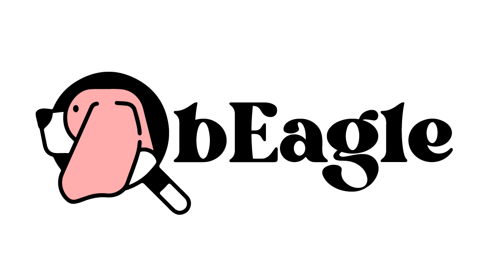

</a>

## Beagle API

bEagle is a web platform that allows users to post lost items, pets or missing people. bEagle solves a particular problem
discovered through research on a certain group of users and makes it easier for them to help each other out. Users can offer rewards and build a reputation on the platform based on ratings from their peers.

## Installation

Before install our api, you should ensure that your local machine has Docker installed.

 * [Linux installation (optimized)](./docs/installation/linux.md)
 * [Windows installation (Coming soon)](./docs/installation/windows.md)

## Knowledge center

 * [Coding standards](./docs/knowledge-center/working-agreements.md)
 * [Academy](./docs/knowledge-center/academy.md)

## Testing

* [Linux guide](./docs/installation/linux.md)
* [Windows guide](./docs/installation/windows.md)

